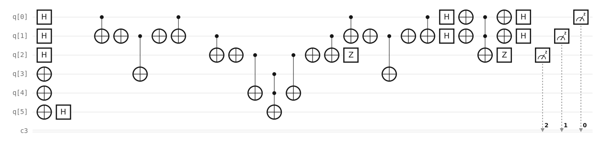
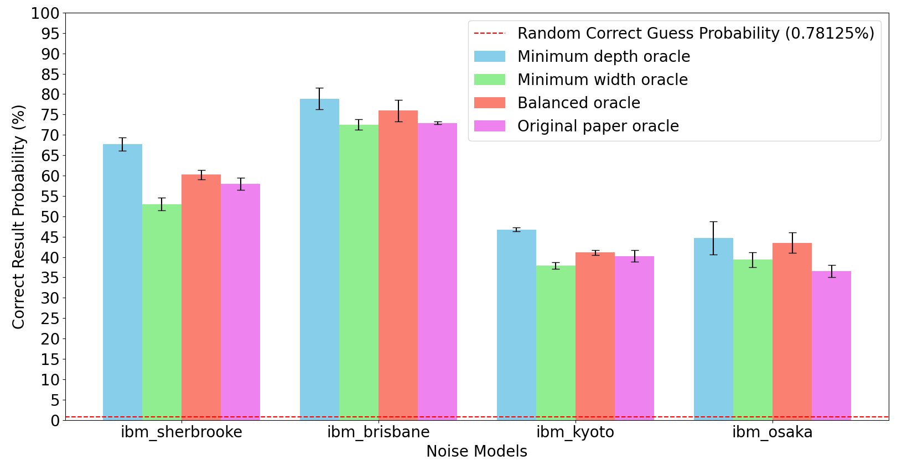
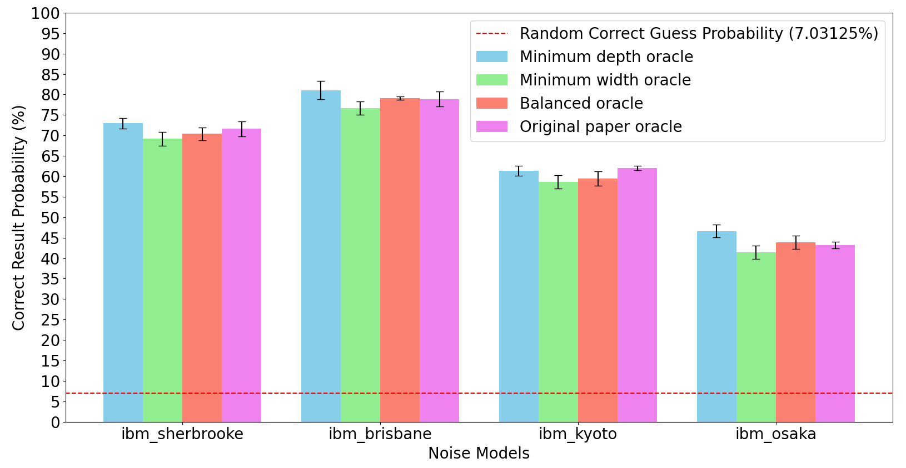
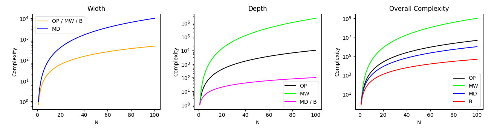

# Circuit generator for Grover K-coloring

This repository contains the code for the generation of quantum circuits for the k-coloring problem.
Also, examples of the generated circuits are present in the qasm directory.

## Dependencies

To run this code, ensure that you have installed the following libraries: qiskit, qiskit aer, networkx, matplotlib, alive progress, scipy, numpy, pylatexenc

## Usage

The `main` function in `main.py` generates a circuit for a specific k-coloring problem.
The parameters are read from the `config.ini` configuration file and can be overriden by passing them as arguments to the funciton.
The `config.ini` file contains explanation for which parameters and what values are accepted. Example usage:

    from main import main
    # The following line generates and simulates locally a complete graph of three colors for k=3
    # using the minimum width approach
    r = main(k=3, system="simple")  
    # r contains information about the outcome of the generation/execution, most of which
    # is already printed by main

## Experiments and Analysis of Results
### Goals of the Experiments
The objectives of our experiments are threefold:
1. To measure the actual *depth*, *width*, and *depth × width* values of circuits generated by the proposed algorithms and compare them with asymptotic values.
2. To verify the correctness of the circuits by simulating their execution in a noiseless environment.
3. To investigate their behavior under realistic noise conditions.
4. To execute a circuit for a small graph on real hardware.

The code for generating the proposed circuits is available on [GitHub](https://github.com/Oscar-Belletti/Grover-K-coloring), allowing circuit generation for a given graph and number of colors, as well as local, IBM server, or IBM quantum hardware simulation. To facilitate replication, we also provide quantum assembly netlists for the circuits used.

### Results
Circuits were synthesized for complete graphs ranging from 5 to 50 nodes using the proposed oracles and the fixed version of the original oracle. The *widths*, *depths*, and *depth × width* complexities were measured and confirmed expected magnitudes. The synthesis results for 5, 20, and 50-node graphs are reported in Table [ref:table_complexities], while Figure [ref:complexities] plots asymptotic complexities for *N* values between 0 and 100.

Correctness was verified through noiseless simulations with `qiskit-aer`, using graphs between 3 and 8 nodes with colors between two and $\min(\text{nodes}, 5)$. Simulations showed correct results above 95%.

Noisy simulations were conducted with 1000 shots for five iterations, and circuit *width*, *depth*, *width × depth*, and probability of correct results are displayed in Figures [ref:hist_noise_8_2] and [ref:hist_noise_5_4]. Depth impacts correctness, with the Minimum Depth oracle performing best. This comes at the cost of a high qubit count, suitable for small graphs but quickly becoming excessive for larger ones, as seen in Table [ref:table_complexities].

The Minimum Width oracle underperforms in noisy simulations and shows no significant improvement over the original or balanced approaches in qubit usage. However, with a $O(N \log N)$ width, it reduces ancillae from $O(N)$ to $O(\log N)$, a notable constant factor reduction, useful for qubit-limited scenarios.

The Original and Balanced approaches perform similarly in *width*, but the Balanced oracle achieves a better *depth* for larger graphs, making it the most practical option. It avoids extreme depth or width, achieving asymptotic optimality under all metrics.

Finally, a simple balanced circuit for a 3-node, 2-color graph was executed on IBM's `ibm_brisbane`, yielding a 61% correct result rate out of 500 shots.

| Metrics    | Original Paper | Minimum Width | Minimum Depth | Balanced |
|------------|----------------|---------------|---------------|----------|
| Nodes = 5  | 24             | 22            | 41            | 24       |
| Nodes = 20 | 133            | 111           | 531           | 131      |
| Nodes = 50 | 365            | 313           | 2226          | 364      |

*Table: Complexity metrics for Grover iteration on complete graphs of 5, 20, and 50 nodes.*

    
